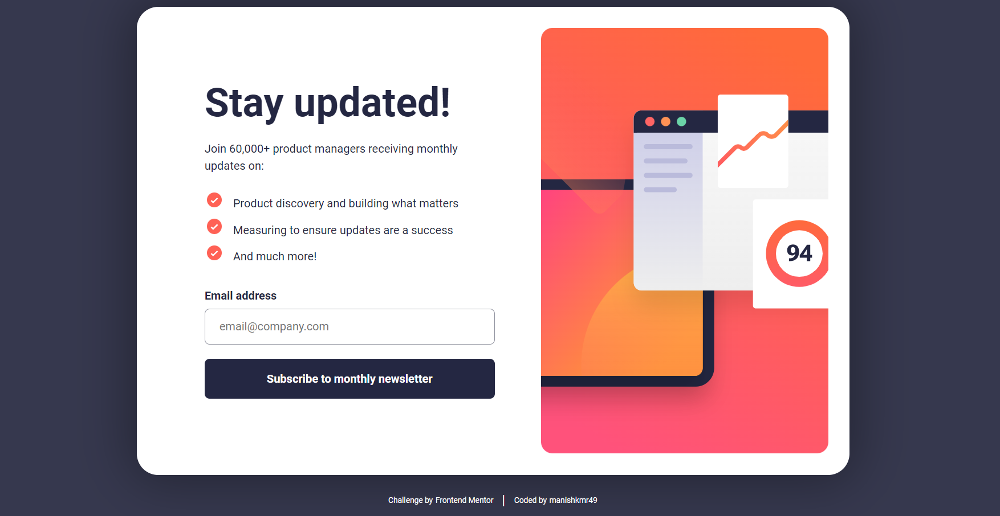

# Frontend Mentor - Newsletter sign-up form with success message solution

This is a solution to the [Newsletter sign-up form with success message challenge on Frontend Mentor](https://www.frontendmentor.io/challenges/newsletter-signup-form-with-success-message-3FC1AZbNrv). Frontend Mentor challenges help you improve your coding skills by building realistic projects.

## Table of contents

- [Overview](#overview)
  - [The challenge](#the-challenge)
  - [Screenshot](#screenshot)
  - [Links](#links)
- [My process](#my-process)
  - [Built with](#built-with)
  - [What I learned](#what-i-learned)
- [Author](#author)

## Overview

### The challenge

Users should be able to:

- Add their email and submit the form
- See a success message with their email after successfully submitting the form
- See form validation messages if:
  - The field is left empty
  - The email address is not formatted correctly
- View the optimal layout for the interface depending on their device's screen size
- See hover and focus states for all interactive elements on the page

### Screenshot



### Links

- Solution URL: [https://www.frontendmentor.io/solutions/newsletter-signup-form-with-success-message-v9Pc4vIFwn](https://www.frontendmentor.io/solutions/newsletter-signup-form-with-success-message-v9Pc4vIFwn)
- Live Site URL: [https://josh76543210-fm-newsletter-sign-up.netlify.app/](https://josh76543210-fm-newsletter-sign-up.netlify.app/)

## My process

### Built with

- HTML
- CSS
- JavaScript

### What I learned

Basic HTML form-submission using JavaScript.

```html
<form class="sign-up-form">
  <label for="email">Email address</label>
  <input id="email" type="email" placeholder="email@company.com" />
  <span class="error-message">Valid email required</span>
  <button class="btn submit-btn">Subscribe to monthly newsletter</button>
</form>
```

```js
// submit email form
function submitEmail(e) {
  e.preventDefault();

  // valid email
  if (validateEmail(emailIn.value)) {
    submittedEmailEl.innerText = emailIn.value;
    toggleCards();
    emailIn.value = "";
    signUpFormEl.classList.remove("error");
  }
  // invalid email
  else {
    signUpFormEl.classList.add("error");
  }
}
```

## Author

- Frontend Mentor - [@josh76543210](https://www.frontendmentor.io/profile/josh76543210)
- Twitter - [@josh76543210](https://www.twitter.com/josh76543210)
